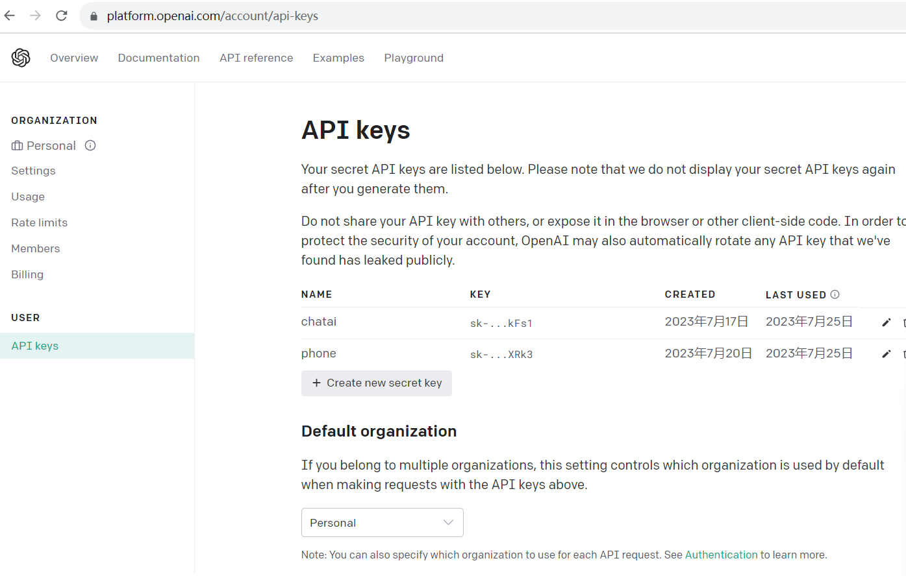

  
  <h1 align="center">ChatGPT</h1>
  
ChatGPT Android Application 

---

**This is an unofficial project solely intended for personal learning and research. It isn't completed so far. But it works well. You just need get chatgpt API Key, and replace the API_KEY in Chatgpt.java **

- **Some individuals have repackaged and sold it for profit.**
- **The name and icon of ChatGPT could potentially lead to infringement disputes.**

How to use it
1) You shall get a key for chatapi from https://platform.openai.com/account/api-keys

2) Set the key in the App setting UI 

3) Start to enjoy AI chat.

